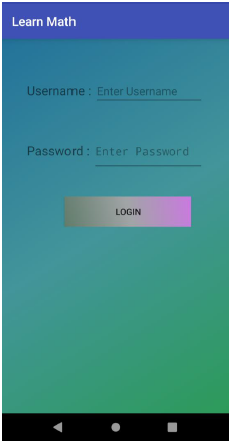
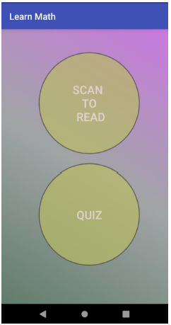
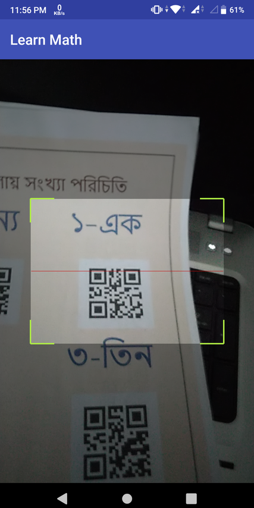
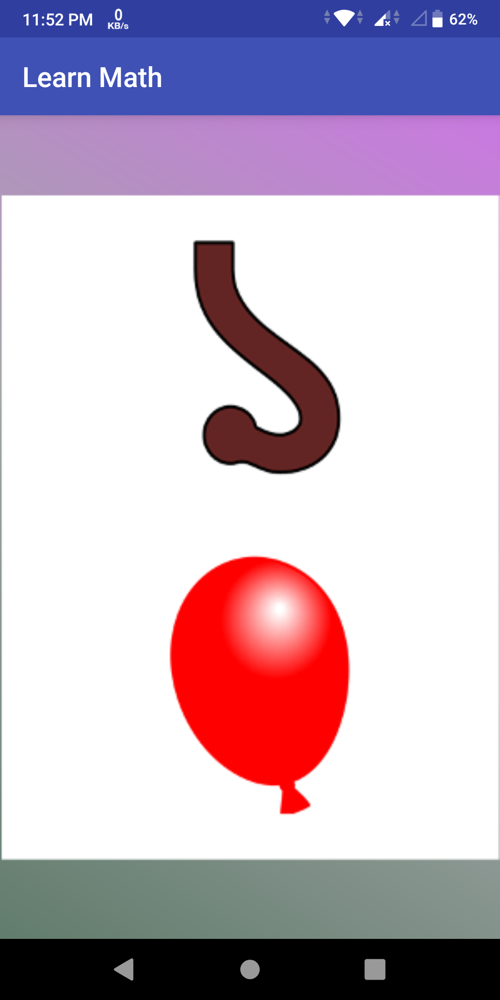

# Learning_Math_with_QRcode
Android app that will help to learn math from book using QR Code.

This app is made for children to learn math.To use this app one should need the corresponding book also.
Here are some preview of the app.

